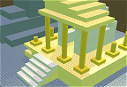
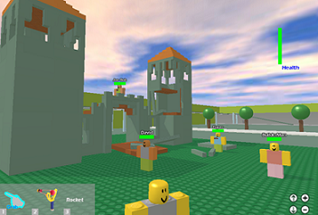

<!DOCTYPE html>
<html lang="pt-br">
<head>
    <meta charset="UTF-8">
    <link rel="icon" type="image/png" href="icon.png">
    <title>ROBLOX.com - Online Building Toy</title>
    
    
</head>
<body>

    

        

            
🛡️ ROBLOX DOUBLE VERIFICATION MATRIX

            
            

                
🤖 [1] CaBlox AI Core v1.08

                
Scanning browser software...

            

            

                
🧱 [2] BuilderFound Behavior Scan

                
Analyzing physical device hardware...

            

            
            
----

            <input type="text" id="captcha-input" class="cablox-input" placeholder="Type Verification Code" autocomplete="off">
            
            <button class="cablox-btn" onclick="verificarCablox()">EXECUTE SECURITY APPROVAL</button>
            

        

    

    

        
        
            <a href="login.html">Login</a> | <a href="login.html">Register</a> | <a href="#">Help</a>
        
    

    

    

        <a href="index.html">Home</a><a href="mypage.html">My Page</a><a href="maintenance.html">Games</a><a href="install.html">Install</a>
    

    

        

            <b>My ROBLOX</b><a href="login.html">Login</a><a href="login.html">Register</a><a href="character.html">Character</a><a href="forum.html">Forum</a>
            

            
Users Online: --

        

        

            <h2>Featured Games</h2>
            

                

                    <b>Chaos Canyon</b>
                    <button class="play-btn" onclick="playOof('Chaos Canyon')">Play</button>
                

                

                    <b>Building Room</b>
                    <button class="play-btn" onclick="playOof('Building Room')">Play</button>
                

            

        

    

    
ROBLOX, "Online Building Toy", characters, logos and trading dress are trademarks of ROBLOX Corporation.

    
    
</body>
</html>
